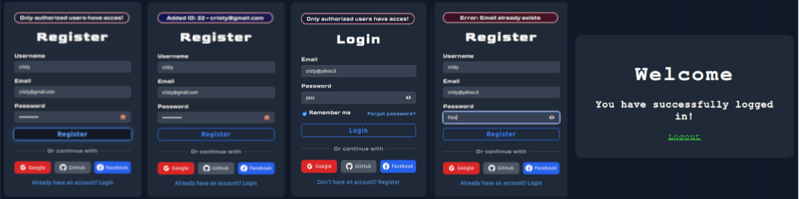

# Go Auth



A scalable authentication server built with Go and the Fiber framework, providing multi-provider OAuth support (Google, GitHub, and Facebook), JWT authentication, and structured middleware for secure and modularized development.

## Table of Contents

- [Screenshots](#screenshots)
- [Project Structure](#project-structure)
- [Features](#features)
- [Setup Instructions](#setup-instructions)
- [Clone the Repository](#clone-the-repository)
- [Environment Setup](#environment-setup)
- [Run the Server](#run-the-server)
- [API Endpoints](#api-endpoints)
- [Additional Notes](#additional-notes)

<!-- ## Screenshots -->

## Project Structure

```sh
go-auth/
├── cmd/                     # Main entry point
│   └── main.go
├── internal/                # Core internal packages
│   ├── auth                 # OAuth and authentication handlers
│   ├── config               # Configuration loader
│   ├── database             # Database connection manager
│   └── middleware           # Auth middleware and configuration middleware
├── models/                  # Data models, e.g., user.go
├── routes/                  # Route setup and grouping
└── web/                     # Frontend files (HTML, CSS, JS, Images)
```

## Features

- **OAuth Authentication**: Login support via Google, GitHub, and Facebook.
- **JWT Tokens**: Secured routes using JSON Web Tokens.
- **Config Management**: Structured configurations using Caarlos0.
- **Database Integration**: Uses GORM for MySQL database integration.
- **Modular Structure**: All code is split into focused modules for readability and scalability.
- **Web Frontend**: Basic frontend with authentication HTML, CSS, and JavaScript.

## Setup Instructions

### Clone the Repository

```bash
git clone https://github.com/scalablescripts/go-auth.git
cd go-auth
```

<p align="right"><a href="#table-of-contents"><strong>↥ Top 🔝</strong></a></p>

### Environment Setup

Add a `.secrets` file in the `tests/` folder with required keys. Example:

```plaintext
DB_USER=username
DB_PASSWORD=password
DB_HOST=localhost
DB_PORT=3306
DB_NAME=goauth

GITHUB_CLIENT_ID=your_github_client_id
GITHUB_CLIENT_SECRET=your_github_client_secret
GOOGLE_CLIENT_ID=your_google_client_id
GOOGLE_CLIENT_SECRET=your_google_client_secret
FACEBOOK_CLIENT_ID=your_facebook_client_id
FACEBOOK_CLIENT_SECRET=your_facebook_client_secret
```

### Run the Server

```bash
make run
```

The server will start on `http://localhost:8000` (configurable in `cmd/main.go`).

## API Endpoints

| Route                  | Method | Description             |
| ---------------------- | ------ | ----------------------- |
| `/auth/login`          | POST   | Logs in a user          |
| `/auth/register`       | POST   | Registers a new user    |
| `/auth/logout`         | POST   | Logs out the user       |
| `/auth/user`           | GET    | Fetches the logged user |
| `/auth/github/login`   | GET    | GitHub OAuth Login      |
| `/auth/google/login`   | GET    | Google OAuth Login      |
| `/auth/facebook/login` | GET    | Facebook OAuth Login    |

## Additional Notes

- **Static Files**: HTML, CSS, and JS files are served from `web/`.
- **Logging**: Uses Logrus for structured logging.

<p align="right"><a href="#table-of-contents"><strong>↥ Top 🔝</strong></a></p>

---
